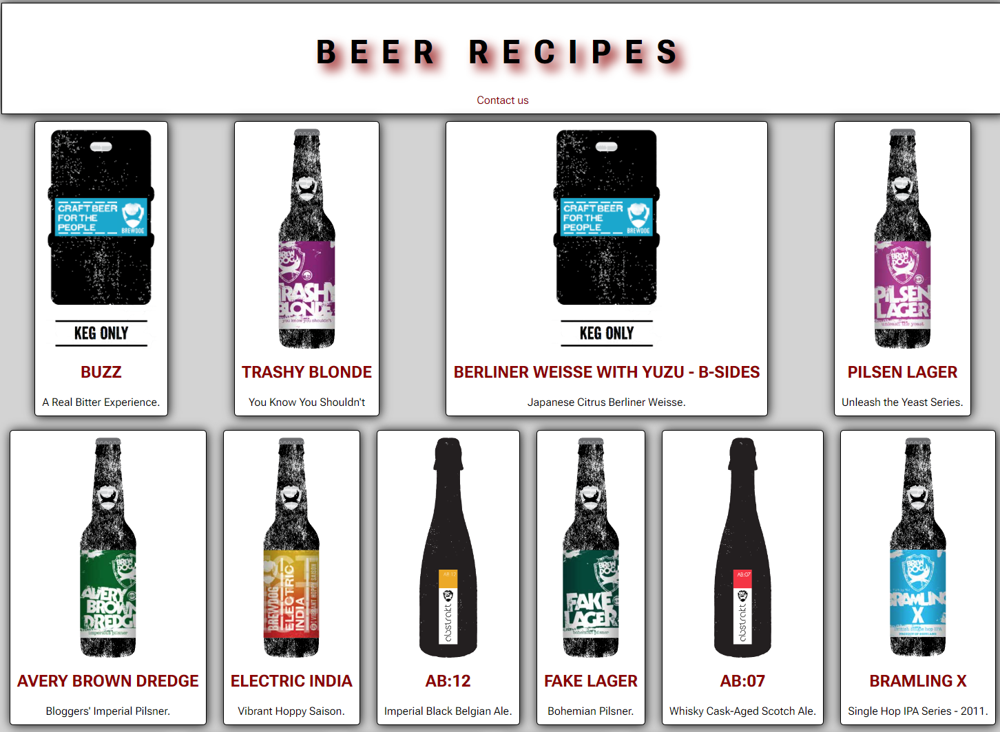

# Beer Recipe

Course Aassignment JavaScript1

API: Beer recipes from PunkAPI
**https://api.punkapi.com/v2/beers**

# Description

I drew a little design idea on a piece of paper and jumped to the HTML and CSS build. I skipped doing a prototype because I did not have any idea about the end result because of me not having any experience with JS before starting this semester.
From having no experience to some idea of how it works I am actually very happy with my result.
It is simple but it works which I hope is the whole idea for this CA.

## Built with

- HTML
- CSS
- Javascript

## Getting started

1. Clone the repo: `https://github.com/HMAsp/hma_js1_ca`

## Contributing

I would appreciate if you would open a pull request so the code can be reviewed if you want to play around with it.

## Contact

If you want to reach out to me please feel free to send me a message on either Twitter or LinkedIn.

[Twitter](https://twitter.com/HansMarAnd)

[LinkedIn](https://www.linkedin.com/in/hma1982/)

# refrences and sources

https://cssloaders.github.io/
https://digitalfortress.tech/tips/top-15-commonly-used-regex/
https://api.punkapi.com/v2/beers
https://developer.mozilla.org/en-US/
https://stackoverflow.com/

Deployed on Netlify: [Deployed on Netlify:](https://soft-basbousa-03b99f.netlify.app/)
